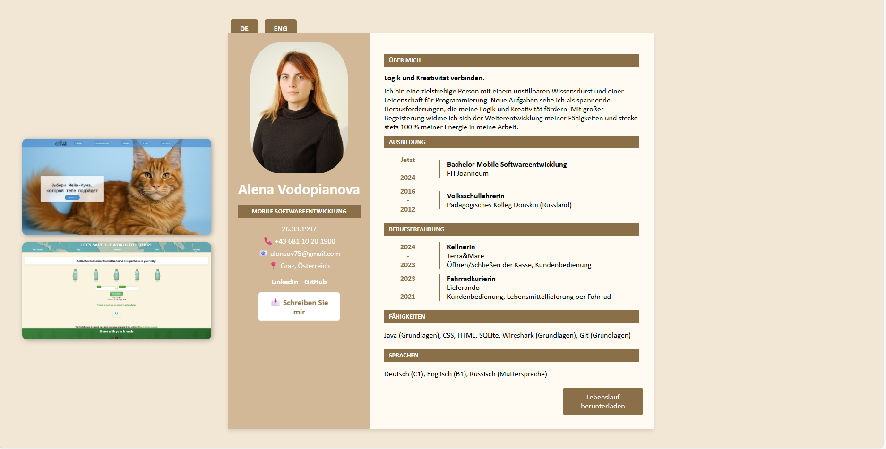

<h1 align="center">🌸 Alena's Digital CV 🌸</h1>

  A sweet & stylish resume website built with love and HTML/CSS 💻✨ 
  <em>Because a girl can be both a dev and a design witch 🧙‍♀️</em>

---

## 🧭 About Me

Hi! I'm **Alena Vodopianova** — a mobile software student at FH Joanneum 📱, a code enthusiast 💻, and a game dev dreamer 🎮.  
I'm working my way from dual IT studies → ✨ support role ✨ → 💥 game development 💥.

---

## 🌐 Live Version

🔗 [Visit My CV Website](https://alenastone.github.io/anothercv)  
_(mobile-friendly, because duh 📱)_

---

## 🛠 Tech Stack

<table>
  <tr>
    <td align="center"> HTML5</td>
    <td align="center"> CSS3</td>
    <td align="center"> VSCode</td>
    <td align="center"> GitHub</td>
    <td align="center">📱 Responsive</td>
  </tr>
</table>

## 📸 Sneak Peek

---

## ☕ Let's Connect

- [LinkedIn](https://www.linkedin.com/in/alena-vodopianova-723b32b0/)
- Email: alonsoy75@gmail.com

---
